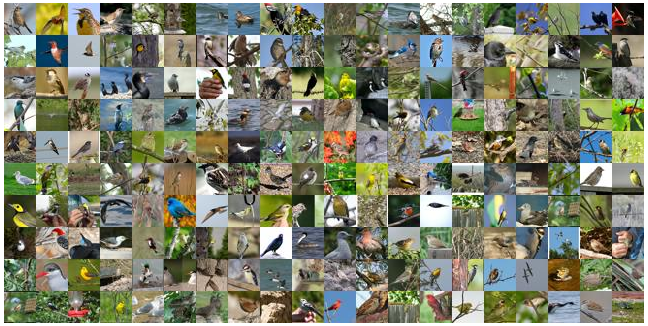

## Bird classification

### Background
This experiment is based on bird images dataset of Caltech-UCSD Birds-200-2011 (CUB-200-2011). We use Transfer Learning and InceptionV3 network, with Azure Data Science Virtual Machine and its pre-installed Keras and Tensorflow framework to implement bird classification.

### Experiment Environment

- Azure Data Science Virtual Machine: NC6 size, Ubuntu
- Keras 2.0.9
- Tensorflow 1.4.0
- Anaconda Python 3.5.2 with CUDA 8.0

#### 1. Create Azure DSVM

Search Azure Data Science Virtual Machine on global Azure portal and start creating. Notice to choose Ubuntu system, HDD type and NC6 size. After created, connet to the VM by Putty.

#### 2. Training environment configuration

Config Keras's backend as Tensorflow. Find keras.json json in "/home/<username>/.keras".
If you want to use Python environment, run "source activate py35" to start the virtual environment.

## Dataset introduction
Dataset if from [Caltech-UCSD Birds-200-2011 (CUB-200-2011)](http://www.vision.caltech.edu/visipedia/CUB-200-2011.html), including bird images of 200 categories, used for bird classification, part detection and segmentation. [Download](http://www.vision.caltech.edu/visipedia-data/CUB-200-2011/CUB_200_2011.tgz)



## Github reference
-  https://github.com/DeepLearningSandbox/DeepLearningSandbox/blob/master/transfer_learning

## Code description
- dataprocess.py: data pre-process, split training set and test set.
- train.py: Data augmentation and train model.
        
   - 50% data as training set, accuracy of training set is 96%，accuracy of validation set is 70%
   - All data as training set, accuracy is 91%.
- test.py: Test Internet image based on trained model.
```
test.py "img url"
```
